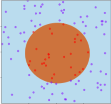
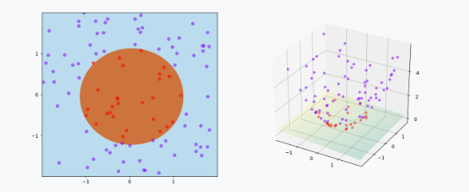

title: "Perceptron and kernalization"
date: 2023-12-05
summary:  A exploration of linear and non-linear decision boundaries in binary classification, focusing on the perceptron algorithm and the kernel trick for transforming non-linearly separable data into a higher-dimensional space where it becomes linearly separable.
categories:

- Classification
- Perceptron & Kernalization

## The Linear Classifier

A linear classifier is a method that classifies data points by computing a linear combination of their features. The decision boundary formed by a linear classifier is a straight line or hyperplane that separates different classes.

We have labeld training data:

$$
(\vec{x_1}, y_1), (\vec{x_2}, y_2)....(\vec{x_n}, y_n)
$$

Decision boundary:

$$
g(\vec{x})=\vec{w} * \vec{x} + w_0 = 0
$$

Linear classifier f(x):

$$
f(\vec{x}) := \begin{cases}
+1 & \text{if } g(\vec{x}) \geq 0 \\
-1 & \text{if } g(\vec{x}) < 0 \end{cases} = sign(\vec{w} * \vec{x} + w_0))
$$

Objective function (omit w0):

$$
\arg \min_{\vec{w}} \frac{1}{n} \sum_{i=1}^{n} 1[\text{sign}(\vec{w} \cdot \vec{x_i}) \neq y_i]

= \arg \min_{\vec{w}} \sum_{x_i \atop s.t. y_i=+1} 1[\vec{x_i} \cdot \vec{w} < 0] + \sum_{x_i \atop s.t. y_i=-1} 1[\vec{x_i} \cdot \vec{w} \geq 0]
$$

Minimize the average misclassification error across all examples to find the weights.

### The Perceptron Problem

Labelled training data:

$$
S = \{ (\vec{x_1}, y_1), (\vec{x_2}, y_2), \ldots, (\vec{x_n}, y_n) \}
$$

Initialize:

$$
\vec{w}^{(0)} = 0
$$

For t = 1,2,3,...

$$
(\vec{x}, y) \in S \space s.t. \space sign(\vec{w}^(t-1) * \vec{x}) \neq y
$$

$$
\vec{w}^{(t)} \leftarrow \begin{cases}
\vec{w}^{(t-1)} + \vec{x} & \text{if } y = +1 \\
\vec{w}^{(t-1)} - \vec{x} & \text{if } y = -1
\end{cases}
$$

Terminate when there is no such misclassification, but when?

## Non-linear Decision Boundaries

Compared to linear decision boundaries, non-linear decision boundries are more common in real life data.

### Linear Transformation

Non-linearly separable data in the original feature space can be transformed into a higher-dimensional space where it becomes linearly separable

Now we have this training data and the decision boundaries is some sort of ellipse

$$
g(\vec{x}) = w_1*\vec{x_1}^2 + w_2*{x_2}^2 + w_0
$$

But, g can be linear in some space:

$$
\phi(x_1, x_2) \mapsto (x_1, x_2, x_1^2 + x_2^2)
$$

### Kernel Methods

The kernel method involves mapping data from its original space (which might be low-dimensional and non-linearly separable) to a higher-dimensional space where a linear decision boundary can separate the classes. This mapping is achieved through a function ϕ(x) which transforms the data points.  Algorithms capable of operating with kernels include the [kernel perceptron](https://en.wikipedia.org/wiki/Kernel_perceptron "Kernel perceptron"), support-vector machines (SVM), [Gaussian processes](https://en.wikipedia.org/wiki/Gaussian_process), [principal components analysis](https://en.wikipedia.org/wiki/Principal_components_analysis "Principal components analysis") (PCA), [canonical correlation analysis](https://en.wikipedia.org/wiki/Canonical_correlation_analysis "Canonical correlation analysis"), [ridge regression](https://en.wikipedia.org/wiki/Ridge_regression "Ridge regression"), [spectral clustering](https://en.wikipedia.org/wiki/Spectral_clustering "Spectral clustering"), [linear adaptive filters](https://en.wikipedia.org/wiki/Adaptive_filter "Adaptive filter") and many others.

$$
f(x) = w^T\phi(x) + b
$$

Note: Kernel methods can be thought of as [instance-based learners](https://en.wikipedia.org/wiki/Instance-based_learning "Instance-based learning"), they area also being called 'lazy learning' rather than learning some fixed set of parameters corresponding to the features of their inputs, they instead "remember" the 𝑖-th training example and learn for it a corresponding weight 𝑤𝑖 (Wikipedia)

#### The Kernel Trick

The kernel trick allows algorithms to operate in the high-dimensional space implicitly, making it computationally feasible to find a linear decision boundary. Explicitly working in generic Kernel space takes time O\(n). But the dot product between two data points in kernel space can be computed really quick, which is the point of the kernel trick.

Let $\phi(x)$ represent the feature vector after mapping x to the feature space, the model corresponding to the hyperplane in the feature space can be expressed as:

$$
f(x) = w^T\phi(x) + b
$$

SVM designed to find the optimal decision boundary **f**(**x**) by maximizing the margin between the two classes.

$$
\min_{\mathbf{w}, b} \frac{1}{2} \|\mathbf{w}\|^2 \\
s.t.
$$

$$
y_i (\mathbf{w}^T \phi(\mathbf{x_i}) + b) \geq 1, \quad i = 1, 2, \ldots, m
$$

The dual problem:

$$
\max_{\alpha} \sum_{i=1}^m \alpha_i - \frac{1}{2} \sum_{i=1}^m \sum_{j=1}^m \alpha_i \alpha_j y_i y_j \phi(\mathbf{x_i})^T \phi(\mathbf{x_j})
$$

$$
s.t.
$$

$$
\sum_{i=1}^m \alpha_i y_i = 0, \space \alpha_i \geq 0, \quad i = 1, 2, \ldots, m
$$

It invovles compute

$ \phi(\mathbf{x_i})^T \phi(\mathbf{x_j})$

This is the inner product of samples xi and xj mapped to the feature space. Since the dimensionality of the feature space can be very high, or even infinite, directly computing it is often difficult. To overcome this obstacle, we can imagine a function:

$$
\kappa(\mathbf{x_i}, \mathbf{x_j}) = \langle \phi(\mathbf{x_i}), \phi(\mathbf{x_j}) \rangle = \phi(\mathbf{x_i})^T \phi(\mathbf{x_j})
$$

This is called **Kernel trick**

Therefore we use $\kappa(\mathbf{x_i}, \mathbf{x_j})$ to replace $\phi(\mathbf{x_i})^T \phi(\mathbf{x_j})$ above optimization:

$$
\max_{\alpha} \sum_{i=1}^m \alpha_i - \frac{1}{2} \sum_{i=1}^m \sum_{j=1}^m \alpha_i \alpha_j y_i y_j \kappa(\mathbf{x_i}, \mathbf{x_j}) \quad
$$

s.t.

$$
\sum_{i=1}^m \alpha_i y_i = 0,  \space \alpha_i \geq 0, \quad i = 1, 2, \ldots, m
$$

After solving, we obtain:

$$
f(x) = \mathbf{w}^T \phi(x) + b \\
     = \sum_{i=1}^m \alpha_i y_i \phi(\mathbf{x_i})^T \phi(x) + b \\
= \sum_{i=1}^m \alpha_i y_i \kappa(x, \mathbf{x_i}) + b \quad
$$

e.g.

- *Quadratic Kernel Transform for Data in R^d*

  - **Explicit Transform** \(O(d^2)\)

$$
\vec{x} \mapsto (x_1^2, \ldots, x_d^2, \sqrt{2} x_1 x_2, \ldots, \sqrt{2} x_{d-1} x_d, \sqrt{2} x_1, \ldots, \sqrt{2} x_d, 1)
$$

- **Dot Products** \(O(d))

  $$
  (1 + \vec{x_i} \cdot \vec{x_j})^2
  $$
- **RBF (Radial Basis Function) Kernel  / Gaussian kernel Transform for Data in R^d**

  - **Explicit Transform**: Infinite Dimension!

    $$
    \vec{x} \mapsto \left( \frac{(2 / \pi)^{d / 4} \cdot \exp(-\|\vec{x} - \alpha\|^2)}{\alpha \in \mathbb{R}^d} \right)
    $$
  - **Dot Products** \(O(d)\)

    $$
    exp\left(-\|\vec{x_i} - \vec{x_j}\|^2\right)
    $$

#### The Kernel Perceptron

From earlier we have:

$$
\vec{w}^{(t)} \leftarrow \vec{w}^{(t-1)} + y \vec{x}
$$

Equivalently:

$$
\vec{w} = \sum_{k=1}^n \alpha_k y_k \vec{x}_k
$$

$$
\alpha_k \space is \space the \space number \space of \space times \space \vec{x}_k \space was \space misclassified
$$

The classification becomes:

$$
f(\vec{x}) := \text{sign}(\vec{w} \cdot \vec{x}) = \text{sign}\left(\vec{x} \cdot \sum_{k=1}^n \alpha_k y_k \vec{x}_k \right) = \text{sign}\left(\sum_{k=1}^n \alpha_k y_k (\vec{x}_k \cdot \vec{x}) \right)
$$

In the transformed space, it would become:

$$
f(\phi(\vec{x})) := \text{sign}\left(\sum_{k=1}^n \alpha_k y_k (\phi(\vec{x}_k) \cdot \phi(\vec{x})) \right)
$$

$$
\sum_{k=1}^n \alpha_k y_k (\phi(\vec{x}_k) \cdot \phi(\vec{x}))
$$

$$
\phi(\vec{x}_k) \cdot \phi(\vec{x})
$$

**dot products are a measure of similarity**

**Can be replaced by any user-defined measure of similarity!**

Therefore, we can work in any user-defined non-linear space implicitly without the potentially heavy computation cost
