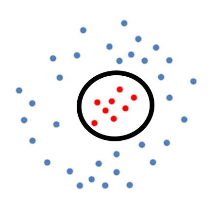
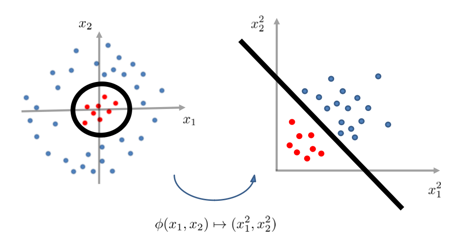

title: "Perceptron and kernalization"
date: 2023-12-05
summary: How does cross entropy loss work with an language model example
categories:

- Classification
- Perceptron & Kernalization

## **Linear Decision Boundaries** :

Learning Linear Decision Boundaries for binary classification (y = {-1, +1})

g = decision boundry

$$
g(\vec{x})=\vec{w} * \vec{x} + w_0 = 0
$$

f = linear classifier

$$
f(\vec{x}) := \begin{cases} 
+1 & \text{if } g(\vec{x}) \geq 0 \\
-1 & \text{if } g(\vec{x}) < 0 \end{cases} = sign(\vec{w} * \vec{x} + w_0)
$$

### The Linear Classifier

A computational unit in a neuron

If we combine to make a network can arrroximate any smooth function

**Learn the weights**

We have labeld training data:

$$
(\vec{x_1}, y_1), (\vec{x_2}, y_2)....(\vec{x_n}, y_n)
$$

Obejective function:

$$
\arg \min_{\vec{w}} \frac{1}{n} \sum_{i=1}^{n} 1[\text{sign}(\vec{w} \cdot \vec{x_i}) \neq y_i]

= \arg \min_{\vec{w}} \sum_{x_i \atop s.t. y_i=+1} 1[\vec{x_i} \cdot \vec{w} < 0] + \sum_{x_i \atop s.t. y_i=-1} 1[\vec{x_i} \cdot \vec{w} \geq 0]
$$

We want to find the average misclassifications error across all the examples to minimize it to get weights

How to minimize it?

We need to make sure its linearly separable! otherwise finding a perfect classifier becomes a NP-hard problem to solve or even approximate!

#### **The Perceptron Algorithm** :

labelled training data:

$$
S = \{ (\vec{x_1}, y_1), (\vec{x_2}, y_2), \ldots, (\vec{x_n}, y_n) \}
$$

Initialize:

$$
\vec{w}^{(0)} = 0
$$

For t = 1,2,3,...

$$
(\vec{x}, y) \in S \space s.t. \space sign(\vec{w}^(t-1) * \vec{x} / \neq y
$$

\vec{w}^{(t)} \leftarrow \begin{cases} 
\vec{w}^{(t-1)} + \vec{x} & \text{if } y = +1 \\
\vec{w}^{(t-1)} - \vec{x} & \text{if } y = -1 
\end{cases}

Terminate when there is no such misclassification, but when?

## Non-linear Decision Boundaries

Compared to linear decision boundaries, non-linear decision boundries are more common in real life data.

### Linear Transformation

Non-linearly separable data in the original feature space can be transformed into a higher-dimensional space where it becomes linearly separable

Now we have this training data and the decision boundaries is some sort of ellipse

$$
g(\vec{x}) = w_1*\vec{x_1}^2 + w_2*{x_2}^2 + w_0
$$

But, g can be linear in some space: 

$$
\phi(x_1, x_2) \mapsto (x_1^2, x_2^2)
$$

Generic quadratic boundary

### Data is Linearly Separable in some Space 

Theorem:

*Given n distinct points*

*$S=\vec{x_i}, \vec{x_2}...$*

**there exists a feature transform such that for any labelling of S is linearly**

**separable in the transformed space!**

### The Kernel Trick

Theoretically we can transform data into kerkenl space then any problem becomes linearly separable! But the problem is that some useful kernel transforms map the input sapce into infinite dimensional space and the model gets very complex and the computation gets expensive.

**Implicit Transformation:** Explicitly working in generic Kernel space

Introduction to the linear classifier

The perceptron algorithm steps

Guarantee of the perceptron algorithm's termination

Perceptron mistake bound theorem and its implications

### **Generalizing Linear Classification to Non-Linear** :

Non-linear decision boundaries and the need for feature transformation

Feature transformation to make problems linearly separable in transformed space

### **The Kernel Trick** :

The kernel trick to handle computation in high-dimensional space

Example of kernel perceptron

Advantages and significance of using kernel tricks for classification

**Summary and Questions** :

Review of decision boundaries, perceptron algorithm, mistake bounds, kernel space generalization, and kernel tricks

### Support Vector Machines (SVMs)
